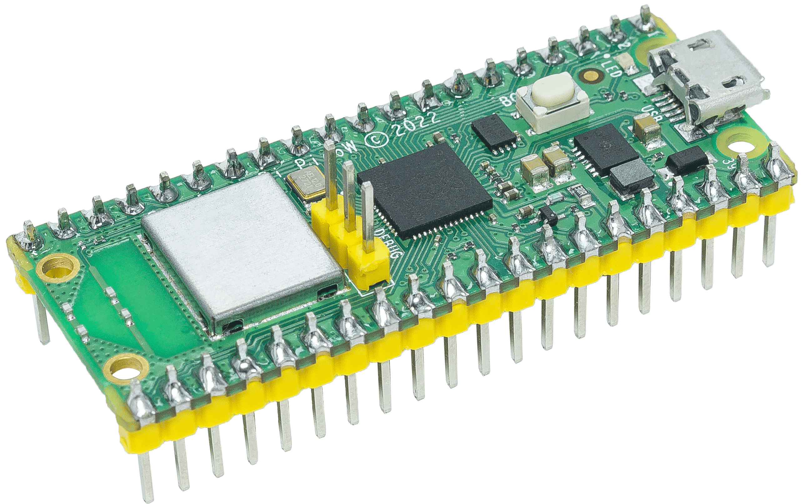
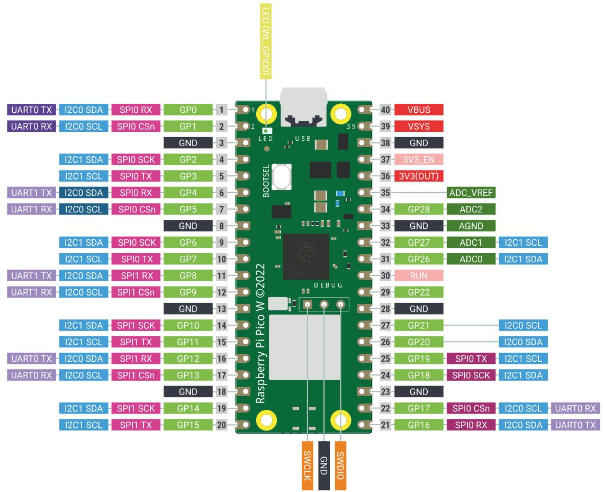

Знакомство с Pico W
=======================================

|pico_w_side|

Raspberry Pi Pico W добавляет беспроводные возможности к популярной линейке микроконтроллерных плат Raspberry Pi Pico. 
В основе Pico лежит наш собственный чип RP2040, а платформа Pico славится высокой производительностью, низкой ценой 
и простотой в использовании.

Raspberry Pi Pico W поддерживает беспроводную сеть 2.4GHz 802.11 b/g/n, имеет встроенную антенну и сертификат 
модульной совместимости. Может работать как в режиме «станции», так и в режиме «точки доступа». 
Полный доступ к сетевым функциям доступен как разработчикам на C, так и на MicroPython.

Raspberry Pi Pico W сочетает в себе RP2040 с 2 МБ флеш-памяти и чипом питания, поддерживающим входное напряжение 
от 1.8 до 5.5 В. На плате есть 26 выводов GPIO, три из которых могут работать в качестве аналоговых входов, 
на стандартных сквозных отверстиях с шагом 0,1" и фрезерованными краями. Raspberry Pi Pico W доступен как поштучно, 
так и в роллах по 480 штук для автоматизированной сборки.

**Характеристики**

* Форм-фактор 21 мм x 51 мм
* Микроконтроллер RP2040, разработанный Raspberry Pi в Великобритании
* Двухъядерный процессор Arm Cortex-M0+ с гибкой частотой до 133 МГц
* 264 кБ встроенной SRAM
* 2 МБ флеш-памяти QSPI на плате
* Беспроводная сеть 2.4GHz 802.11n
* 26 многофункциональных GPIO, включая 3 аналоговых входа
* 2 x UART, 2 x SPI, 2 x I2C, 16 каналов PWM
* 1 x USB 1.1 контроллер и PHY, с поддержкой режима хоста и устройства
* 8 программируемых PIO (Programmable I/O) для создания своих периферийных модулей
* Поддержка входного питания от 1.8 до 5.5 В
* Рабочая температура от -20°C до +70°C
* Фрезерованные контактные площадки позволяют припаивать модуль прямо на материнскую плату
* Программирование методом drag-and-drop (перетаскивания) через USB
* Низкопотребляющие режимы сна и «dormant»
* Точный встроенный генератор тактовой частоты
* Датчик температуры
* Акселерация целочисленных и плавающих вычислений на аппаратном уровне

**Выводы Pico**

|pico_pin|

.. list-table::
   :widths: 3 5 10
   :header-rows: 1

   * - Название
     - Описание
     - Функция
   * - GP0–GP28
     - Цифровые входы/выходы общего назначения (GPIO)
     - Могут работать как вход или выход; не имеют фиксированного назначения
   * - GND
     - Общий (нулевой) контакт
     - Несколько контактов GND по периметру Pico W для удобства подключения
   * - RUN
     - Управление питанием Pico (включение/выключение)
     - Позволяет запускать и останавливать Pico W с другого микроконтроллера
   * - GPxx_ADCx
     - GPIO или аналоговый вход
     - Могут быть как аналоговыми входами, так и цифровыми (не одновременно)
   * - ADC_VREF
     - Опорное напряжение для АЦП
     - Специальный вход, задающий опорное напряжение для аналоговых входов
   * - AGND
     - Общий (нулевой) контакт для АЦП
     - Специальная земля для работы с ADC_VREF
   * - 3V3(O)
     - Питание 3,3 В
     - Источник 3,3 В, которым питается сама Pico W, получаемый от VSYS
   * - 3V3(E)
     - Управление питанием 3,3 В
     - Позволяет включать и выключать линию 3V3(O), а значит и саму Pico W
   * - VSYS
     - Питание от 2 до 5 В
     - Контакт напрямую соединён с внутренним источником питания Pico; выключение этого контакта обесточит всю плату
   * - VBUS
     - Питание 5 В
     - Источник 5 В от micro-USB порта Pico; можно использовать для устройств, требующих более 3,3 В

Лучшее место, чтобы найти всю необходимую информацию для начала работы с Raspberry Pi Pico W —
`официальная документация <https://www.raspberrypi.com/documentation/microcontrollers/raspberry-pi-pico.html>`_.

Или вы можете перейти по ссылкам ниже:

* `Raspberry Pi Pico W product brief <https://datasheets.raspberrypi.com/picow/pico-w-product-brief.pdf>`_
* `Raspberry Pi Pico W datasheet <https://datasheets.raspberrypi.com/picow/pico-w-datasheet.pdf>`_
* `Getting started with Raspberry Pi Pico: C/C++ development <https://datasheets.raspberrypi.org/pico/getting-started-with-pico.pdf>`_
* `Raspberry Pi Pico C/C++ SDK <https://datasheets.raspberrypi.org/pico/raspberry-pi-pico-c-sdk.pdf>`_
* `API-level Doxygen documentation for the Raspberry Pi Pico C/C++ SDK <https://raspberrypi.github.io/pico-sdk-doxygen/>`_
* `Raspberry Pi Pico Python SDK <https://datasheets.raspberrypi.org/pico/raspberry-pi-pico-python-sdk.pdf>`_
* `Raspberry Pi RP2040 datasheet <https://datasheets.raspberrypi.org/rp2040/rp2040-datasheet.pdf>`_
* `Hardware design with RP2040 <https://datasheets.raspberrypi.org/rp2040/hardware-design-with-rp2040.pdf>`_
* `Raspberry Pi Pico W design files <https://datasheets.raspberrypi.com/picow/RPi-PicoW-PUBLIC-20220607.zip>`_
* `Raspberry Pi Pico W STEP file <https://datasheets.raspberrypi.com/picow/PicoW-step.zip>`_