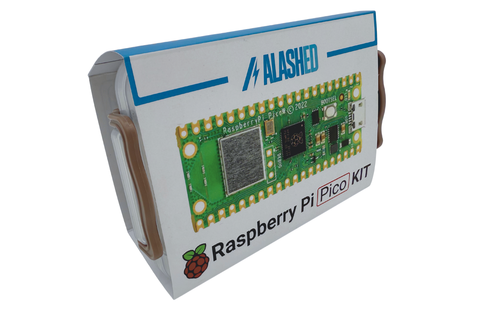

Alashed Raspberry Pi Pico W Kit
======================================================================================================

Набор **Raspberry Pi Pico W Kit** — это универсальный комплект для разработчиков,
основанный на микроконтроллере *Raspberry Pi Pico W*.  
Он отлично подходит как для начинающих, так и для опытных пользователей,
позволяя изучать программирование, взаимодействие с электроникой
и быстро создавать собственные проекты.

MicroPython Projects
~~~~~~~~~~~~~~~~~~~~

Руководства содержат пошаговые примеры на **MicroPython**, показывающие,
как подключать и программно управлять всеми перечисленными модулями.
Каждый урок включает:

* схему подключения;  
* исходный код с подробными комментариями;  
* объяснение работы программы;  
* задания для самостоятельной практики.  

С помощью этих материалов вы сможете быстро научиться
писать собственные скрипты, считывать данные с датчиков
и управлять исполнительными устройствами.

.. toctree::
   :maxdepth: 1
   :caption: Содержание:

   about/index
   get-started/index

.. toctree::
   :maxdepth: 3

   lessons/index

.. toctree::
   :maxdepth: 1

   faq/index
   feedback/index

Уведомление об авторских правах
----------------------------------------
Все материалы, включая, помимо прочего, тексты, изображения и программный код, содержащиеся в настоящем руководстве, являются собственностью компании SunFounder. Вы вправе использовать их только для личного обучения, исследования, ознакомления или иных некоммерческих либо не‑приносящих прибыль целей в соответствии с действующими нормативными актами и законами об авторском праве, не нарушая законные права автора и других правообладателей. Любое физическое или юридическое лицо, использующее эти материалы в коммерческих целях без разрешения компании, может быть привлечено к ответственности в судебном порядке.